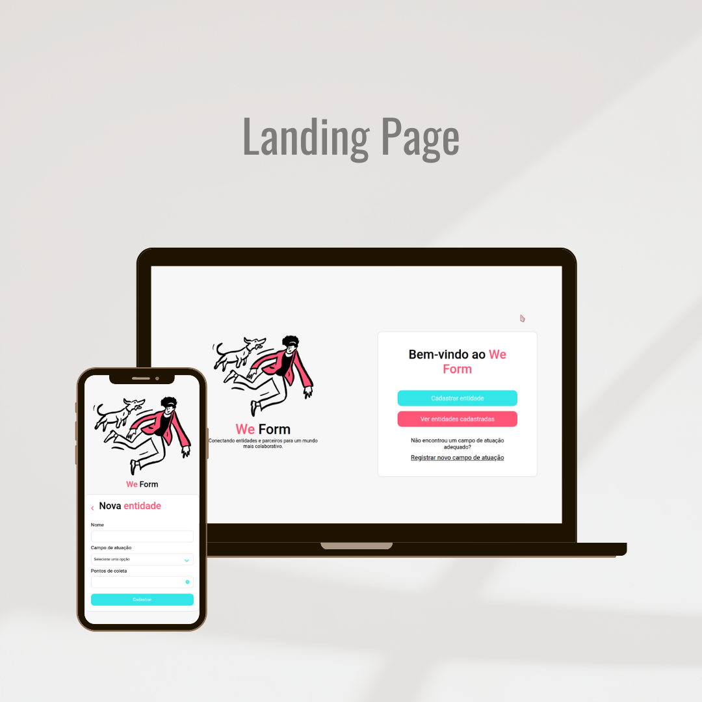

# WeForm

WeForm é uma landing page inovadora que conecta entidades e parceiros, apresentando a proposta da plataforma de forma clara e objetiva. Através de uma interface intuitiva, facilita o cadastro e a organização de informações de instituições que desejam oferecer ou receber apoio. Os usuários podem realizar diversas ações, como cadastrar novas entidades, visualizar as já cadastradas e adicionar novos campos de atuação, promovendo uma gestão eficiente e colaborativa.

---

## 🚀 Funcionalidades

- **Apresentação do WeForm**:  
  Texto descritivo e imagem ilustrativa que destacam a proposta da plataforma.

- **Cadastro de Entidades**:  
  Formulário simples e intuitivo para adicionar novas entidades com nome, campo de atuação e pontos de coleta.

- **Navegação Dinâmica**:  
  Links diretos para as funcionalidades principais, como cadastrar entidades ou visualizar as cadastradas.

---

## 🛠️ Tecnologias Utilizadas

- **HTML5**: Estrutura semântica da página.  
- **CSS3**: Estilização moderna e responsiva.  

---

## 🌐 Deploy

Acesse o projeto clicando no link abaixo:  
[WeForm](https://gabrielabade.github.io/weform/)  

---

## 📸 Prévia do Projeto  

  
